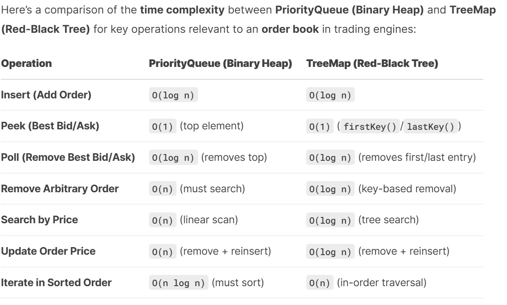
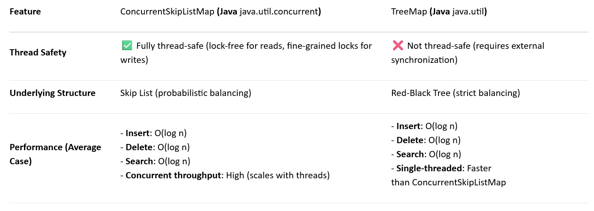

# Matching-Engine Project

## Developer Information

**Name:** George Fung

**Email:** georgefungkp@gmail.com

**GitHub Username:** georgefungkp

**LinkedIn Profile:** https://www.linkedin.com/in/george-fung

## Introduction

This project implements a Matching Engine, a key component in trading platforms and exchanges, responsible for handling buying and selling orders and matching them based on specific logic. The project is developed using Java SDK version 22 and helps understand the working of real-world trade execution.

## Features

 - Efficient order handling and order book maintenance
 - Supports **limit** as well as **market** orders
 - Real-time matching logic. When best_bid >= best_ask, the trade executes at the _ask price_ (lower price)
 - After order matching, trade and market data are sent to Client. 
 - Extensible and maintainable code
 - Supports internal message format as well as FIX message format

## Getting Started

### Prerequisites

List here the prerequisites and links to the installation procedure of each:

- [Java SDK](https://www.oracle.com/java/technologies/downloads/)
- An IDE of your choice (Although this project was developed using Intellij IDEA)

## Time Complexity of main operations

| Operation    | Time Complexity          |
|:-------------|:-------------------------|
| Place Order  | O(log n)                 |
| Cancel Order | O(1)                     |
| Amend Order  | Qty O(1), Price O(log n) |
| Search Order | O(1)                     |

## Design Consideration
- The time complexity of order handling is shown as below:

| Operation               | PriorityQueue(Binary Heap) | TreeMap(Red-black Tree)    |
|:------------------------|:---------------------------|:---------------------------|
| Insert                  | O(log n)                   | O(log n)                   |  
| Peek (Best Bid/Ask)     | O(1) (top element)         | O(1) (firstKey()/lastKey() |
| Remove                  | O(n)                       | O(log n)                   |
| Search by Price         | O(n)                       | O(log n)                   |
| Iterate in Sorted Order | O(n log n)                 | O(n)                       |

- The data structure of order book is <b> Tree map </b> with <b> LinkedList </b>. So, the time complexity of a new limit price is O(log n), and first or last key is O(1) as Java always caches the leftmost/rightmost nodes. For cancellation, it's also O(log n). On average, Tree map is the best choice in JDK implementation.

- In the single-thread environment, TreeMap ensures the performance is O(log n). However, TreeMap may not be the best choice in the concurrency. It's not thread-safe and developer has to handle race conditions.
So, I choose to use <b>ConcurrenctSkipListMap</b> to replace TreeMap as it is good for individual atomic operations. All basic operations (put, get, remove) are thread-safe by design 
so that it provides atomicity for single operations.

- Use Hashmap to record order object reference so that it's easy to amend or cancel the order. 
- Order object pool is created so that we can minimize the number of objects and times of GC in the memory, and reduce latency of order creation.
- Difference exchanges give different priority to market order. In this design, the market order is treated as the best available order and is executed first.

### Design Patterns
I have applied several common design patterns in my system design. 
1. **Object Pool Pattern**
    - Clearly implemented through `OrderPoolManager``OrderObjectPool``TradeObjectPool`
    - Used to manage and reuse Order and Trade objects
    - Helps reduce the overhead of creating new objects by recycling unused ones

2. **Singleton Pattern**
    - Used in with static initialization and methods `OrderPoolManager`
    - Ensures single instances of order and trade pools per stock
    - Manages the lifecycle of order and trade objects globally

3. **Factory Method Pattern**
    - Implemented in with methods like and `OrderPoolManager``requestOrderObj``requestTradeObj`
    - Encapsulates object creation logic while maintaining the object poo

4. **Observer Pattern**
    - The system uses multiple queues: `orderQueue``marketDataQueue``resultingTradeQueue`
    - Different components observe and process these queues

5. **Command Pattern**
    - Orders represent commands that need to be executed
    - Each order encapsulates all necessary information for processing
    - Different types of orders (Market, Limit) can be processed differently

6. **Strategy Pattern**
    - Different order types (MARKET, LIMIT) suggest different execution strategies
    - Order matching can be performed using different strategies based on an order type

## Message cycle of FIX in a trade 
[The following is just for information. Not every message type is implemented in the project.]
First, the basic steps in a trade: order initiation, routing, execution, confirmation, and settlement. Each step corresponds to specific FIX messages. Let me list them in order.

1. **Logon (A)**: The session starts with a Logon message to establish the connection. Both parties exchange this to authenticate.

2. **New Order Single (D)**: The client sends a new order using the D message. It includes details like symbol, quantity, price, etc.

3. **Execution Report (8)**: The broker responds with an Execution Report. Initially, this might be an acknowledgment (Pending New), then updates as the order is filled.

4. **Order Cancel/Replace Request (G)**: If the client wants to modify the order, they send a G message.

5. **Order Cancel Request (F)**: To cancel an order, an F message is sent.

6. **Trade Capture Report (AE)**: Post-trade, this message confirms the details of the executed trade.

7. **Allocation (AS)**: For multi-account trades, allocations are sent to distribute the executed quantity.

8. **Confirmation (AK)**: Final confirmation of the trade details and settlement instructions.

9. **Logout (5)**: Ends the session

#### Example Workflow Summary:
Logon(Logon (A)) → 2. New Order(New Order Single (D)) → 3. Order Ack(Execution Report (8) with ExecType=0)
→ 4. Execution Report(Execution Report (8) with ExecType=F) → 5. Trade Capture Report(Trade Capture Report (AE))
→ 6. Allocation(Allocation Instruction (AS)) → 7. Settlement(Settlement Instructions (T)) → 8. Logout(Logout (5))

